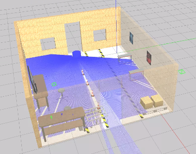

# my_rb1_gazebo



## Dependencies

- [warehouse_robot_lab](https://rodrigo55@bitbucket.org/theconstructcore/warehouse_robot_lab.git)
  - Note that this is a private repository that's only currently available from The Construct
  - Installed by The Construct in simulation_ws
- [my_rb1_description](https://github.com/christophomos/my_rb1_description)

# Instructions

After compiling this project and its dependencies using `catkin build`, open the following shells and run in each

1. gazebo
```
source ~/simulation_ws/devel/setup.bash
source ~/catkin_ws/devel/setup.bash
export ROS_PACKAGE_PATH='/home/user/catkin_ws/src:/opt/ros/noetic/share:/home/user/simulation_ws/src'
roslaunch my_rb1_gazebo my_rb1_robot_warehouse.launch
```
2. spin - the RB1 rotates slowly in place
```
source ~/catkin_ws/devel/setup.bash
rostopic pub /cmd_vel geometry_msgs/Twist "linear:
  x: 0.0
  y: 0.0
  z: 0.0
angular:
  x: 0.0
  y: 0.0
  z: 0.1"
```
In the spin window, after killing the `rostopic pub` with CTRL-C, you can run
```
rostopic echo /scan -n1
```
```
rostopic echo /odom -n1
```
